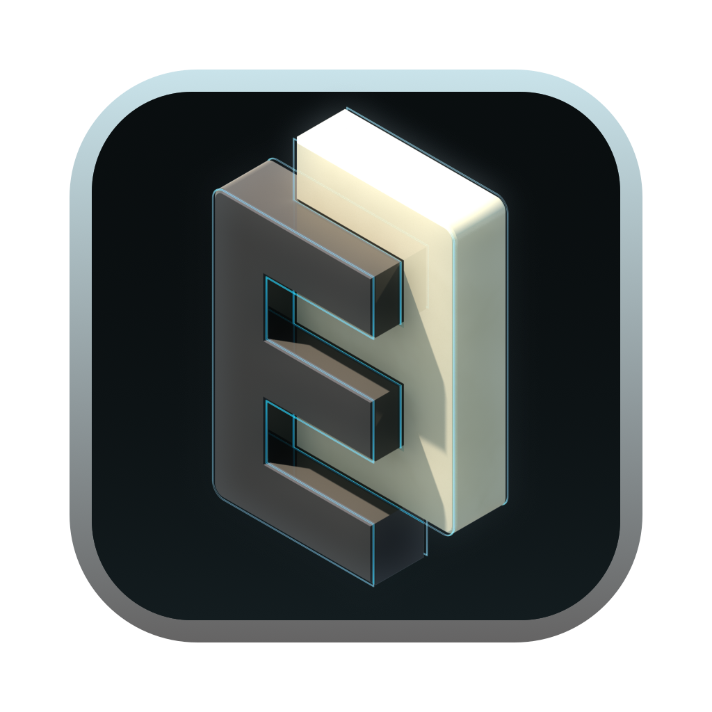
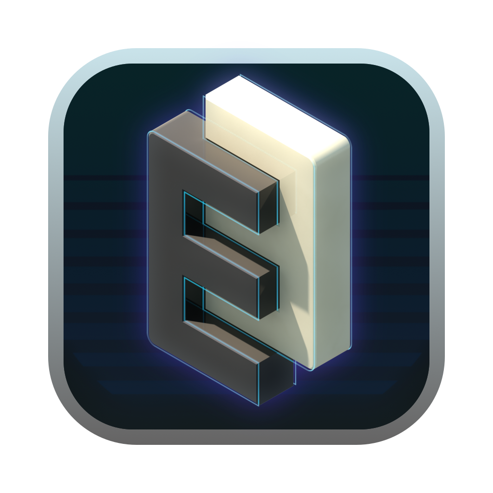

> Hi all, Please consider donating to this or any of my many of opensource projects.
> 
> 

# Emacs icons project

Please note, these are not "official" GNU icons.

I created these for my own use, I'm fairly OCD about visual stuff, and
I decided to share these with the community.

Application icons are in the root folder, document type icons are in
the `document-icons` folder.

# News

Added 2 new icons on Sept 7 2022.

### EmacsTerm

### EmacsVapor

# Mac OS X

Pick an Application icon style you like and copy that to Emacs.app

ie.

    cp emacs-card-blue-deep.icns /Applications/Emacs.app/Contents/Resources/Emacs.icns

To install the document icons:

    cp document-icons/*.icns /Applications/Emacs.app/Contents/Resources/

Backup `Info.plist` and copy the version from here, ie.:

    cp /Applications/Emacs.app/Contents/Info.plist /Applications/Emacs.app/Contents/Info.plist.bak

    cp document-icons/Info.plist /Applications/Emacs.app/Contents/Info.plist

## Linux

If necessary, downscale the pngs to sizes your window manager likes.

    mkdir linux-icons;
    for icon in document-icons/*.png
    convert -size 256x256 $icon linux-icons/$icon

## Windows

Use png to ico.

## Automating doc-icons

There is a template for building document-icons.

Within `document-icons/` you'll find:

  * document-icons/doc-types.yaml
  * document-icons/doc-icon.mustache - an SVG template
  * document-icons/make-svg-icons.rb

I used InkScape to make the PNG files from SVG and [`makeicns`](https://bitbucket.org/mkae/makeicns) to make the
document icns.

I've also included an OS X Info.plist.

The font used is Avenir Next, it's part of Mountain Lion's default
font set.

- - -

# Document Icons

A small sample

# Application Icons

EmacsTerm

EmacsVapor

EmacsIcon1

* * *

EmacsIcon2

* * *

EmacsIcon3

* * *

EmacsIcon4

* * *

EmacsIcon5

* * *

EmacsIcon6

* * *

EmacsIcon7

* * *

EmacsIcon8

* * *

EmacsIcon9

* * *

Emacs-card-blue-deep

* * *

Emacs-card-british-racing-green

* * *

Emacs-card-carmine

* * *

Emacs-card-green

* * *

# Icon base

Base icon motif - used to create all icons above.

(An early version)

---

# Use and Contributing

Do what you like with these, if you want to use them / modify etc, go
ahead.

MIT License applies.
